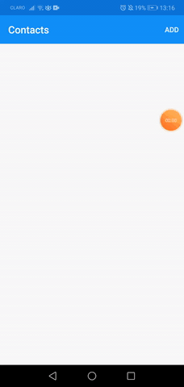
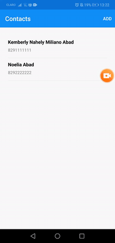
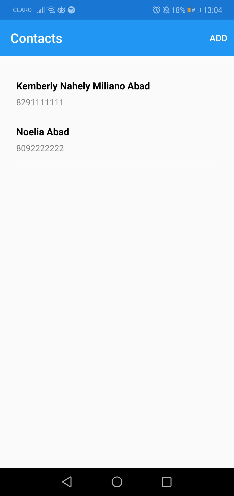
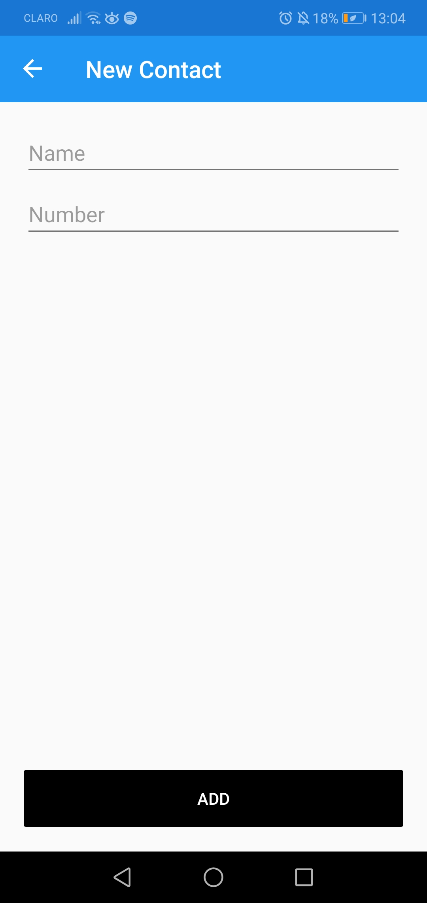
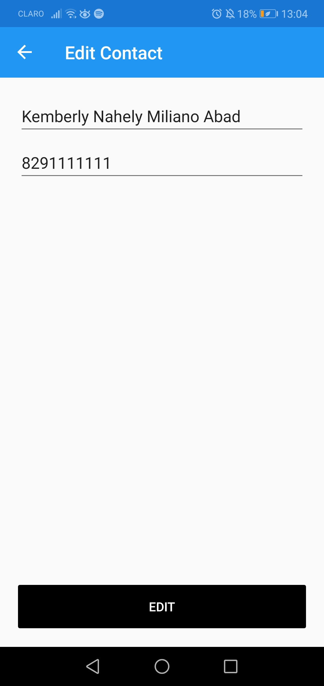
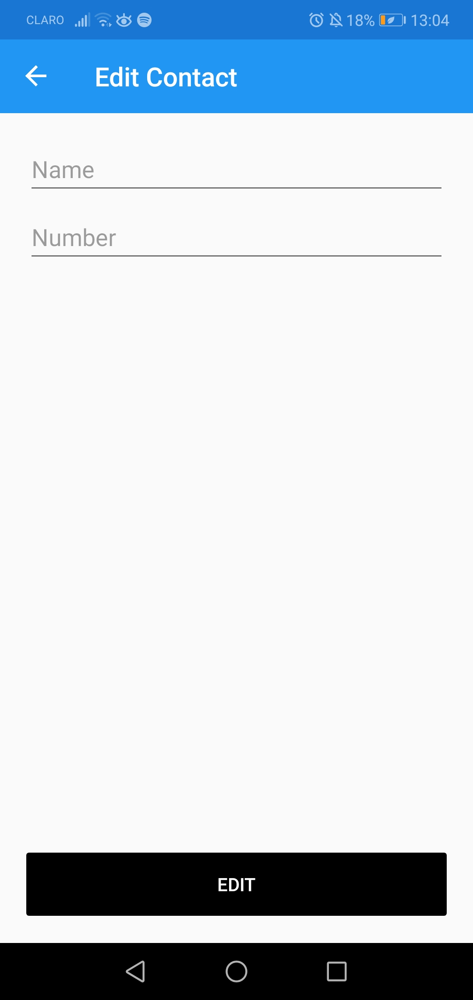

# Contact Agenda Sample App

This project contains a simple list of contacts, each of which can be viewed in a detailed list. Contacts can be edited, deleted and called through this app. 

<table border="0" cellpadding="0" cellspacing="0">
<tr>
<td> </td> 
<td>   </td>
<td></td>
</tr>
</table>

## Screens:
The app has three main screens:

- A contact list screen

- A contact creation screen

- A contact edition screen

### *Contact list screen*

### *Contact creation screen*

</td>

### *Contact edition screen*
<table>
<tr>
<td></td>
<td></td>
</tr>
</table>
